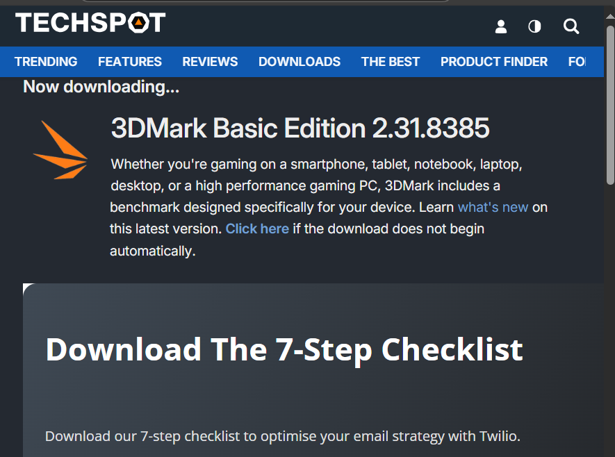
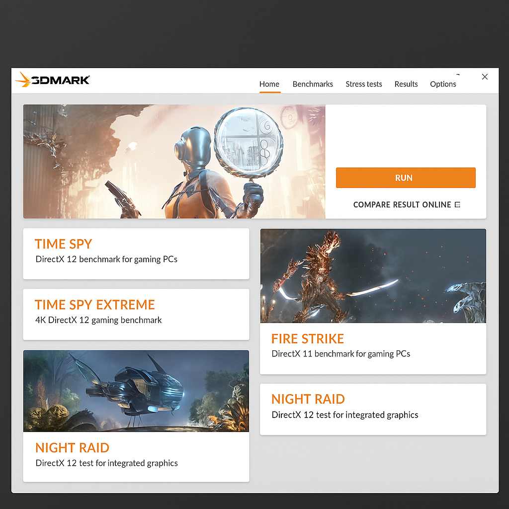
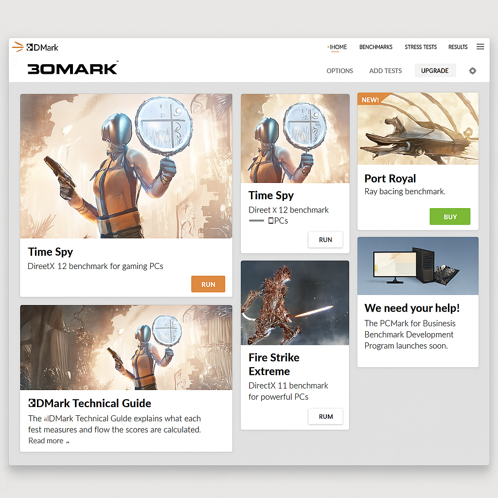

# Guía Completa de 3DMark

## Introducción
3DMark es el estándar para benchmarking de GPU, probando el rendimiento en juegos y aplicaciones gráficas intensivas.

## Descarga e Instalación

1. Disponible en Steam o página oficial: [https://www.3dmark.com/](https://www.3dmark.com/)
2. Versión básica gratuita con pruebas limitadas
3. Versión Advanced con más pruebas (de pago)

## Pruebas Principales

1. **Time Spy**: Para sistemas con DirectX 12
2. **Fire Strike**: Para PCs gaming tradicionales
3. **Port Royal**: Prueba de ray tracing

## Interpretación de Resultados

- **Puntuación general**: Cuanto mayor, mejor rendimiento
- **FPS promedio**: Fotogramas por segundo durante la prueba
- **Comparativa**: Puedes comparar con otros sistemas similares

