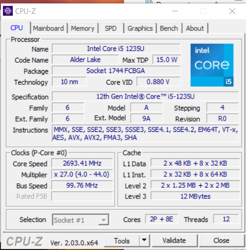

# Guía Completa de CPU-Z

## Introducción
CPU-Z es una herramienta ligera que muestra información detallada sobre los componentes principales de tu sistema, especialmente el procesador, memoria y placa base.

## Descarga e Instalación

1. Visita el sitio oficial: [https://www.cpuid.com/softwares/cpu-z.html](https://www.cpuid.com/softwares/cpu-z.html)
2. Descarga la versión estándar (no requiere instalación) o la versión instalable
3. Ejecuta el archivo .exe

## Uso Básico

### Pestañas principales:

1. **CPU**: Muestra modelo, arquitectura, frecuencia y caché
   - Frecuencia base y actual (en tiempo real)
   - Número de núcleos e hilos

2. **Caches**: Información detallada de caché L1, L2, L3

3. **Mainboard**: Modelo de placa base, chipset y BIOS

4. **Memory**: Tipo, tamaño y frecuencia de RAM

5. **SPD**: Detalles por cada módulo de memoria

## Interpretación de Datos

- **Multiplicador**: Relación entre frecuencia base y frecuencia real
- **Voltaje**: Importante para overclocking
- **Temperatura**: Requiere complemento como HWMonitor