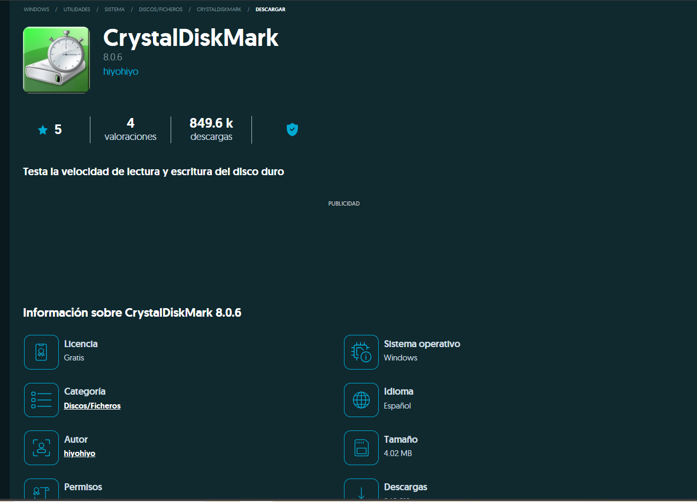
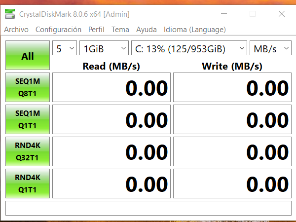

# Guía Completa de CrystalDiskMark

## Introducción
Herramienta para medir el rendimiento de lectura/escritura de discos duros y unidades SSD.

## Descarga e Instalación

1. Descarga desde: [https://crystalmark.info/en/software/crystaldiskmark/](https://crystalmark.info/en/software/crystaldiskmark/)
2. Versión portable disponible (no requiere instalación)
3. Ejecuta como administrador para mejores resultados

## Configuración de Prueba

1. **Tamaño de prueba**: 1GB es estándar
2. **Número de pasadas**: 5-9 para resultados consistentes
3. **Selección de unidad**: Elige la unidad a testear

## Interpretación de Resultados

- **Seq Q32T1**: Rendimiento secuencial (ideal para grandes archivos)
- **4K Q32T1**: Rendimiento con archivos pequeños y colas
- **4K**: Rendimiento con archivos pequeños sin colas

