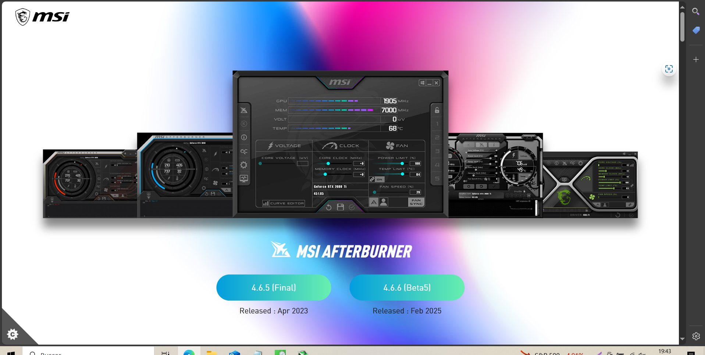
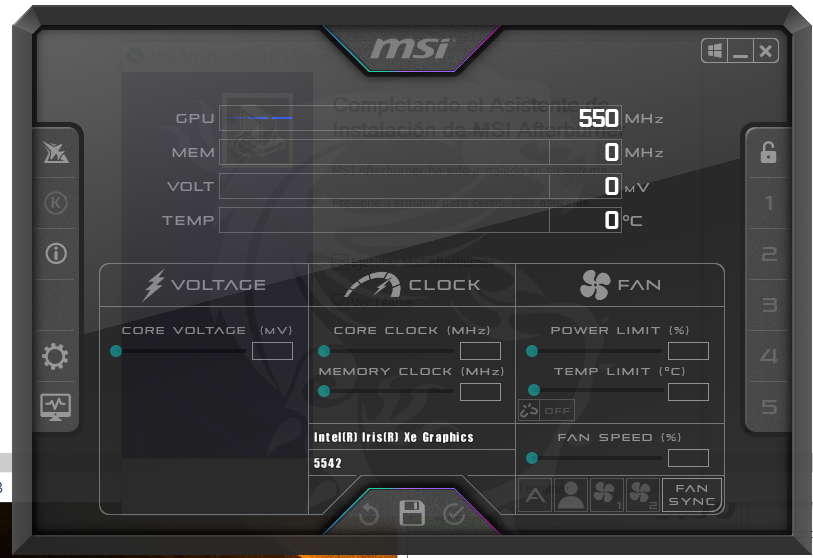

# Guía Completa de MSI Afterburner

## Introducción
Herramienta para overclocking y monitoreo de tarjetas gráficas, compatible con casi todas las GPUs.

## Descarga e Instalación

1. Descarga oficial: [https://www.msi.com/page/afterburner](https://www.msi.com/page/afterburner)
2. Incluye RivaTuner Statistics Server (para OSD)
3. Instalación sencilla con opciones por defecto

## Funciones Principales

1. **Control de velocidad de ventiladores**
2. **Ajuste de voltaje y potencia**
3. **Monitoreo en tiempo real**
4. **OSD en juegos**

## Configuración Básica

1. **Limite de potencia**: Aumenta gradualmente (no sobrepasar 110-120%)
2. **Temperatura objetivo**: Establece límite seguro (80-85°C para mayoría GPUs)
3. **Curva de ventilador**: Balance entre ruido y refrigeración

